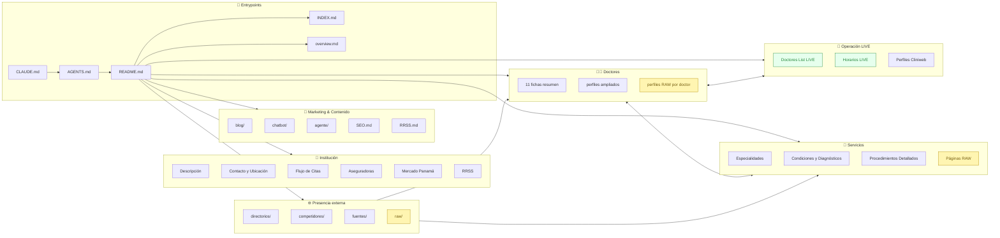

# 🏥 CEOSA Vault — Guía Humana del Workspace

> **Centro de Especialidades Ortopédicas (CEOSA)** — Primer grupo ortopédico fundado en Panamá.
> **Sitio web:** <https://ortopedasdepanama.com>
>
> Este `README.md` es la **puerta de entrada humana** del workspace.
> Para la guía técnica/terminal (comandos `rg`/`grep`/`find`, tags, labels, KEY::values) ver [`INDEX.md`](./INDEX.md).
> Para el resumen ejecutivo del vault ver [`overview.md`](./overview.md).

---

## 🚪 Por dónde empezar

| Necesito…                                  | Archivo                                                  |
| ------------------------------------------ | -------------------------------------------------------- |
| Mapa humano del vault (este archivo)       | `README.md`                                              |
| Comandos para barrer/scrapear todo         | [`INDEX.md`](./INDEX.md)                                 |
| Resumen ejecutivo                          | [`overview.md`](./overview.md)                           |
| Contacto, sede, canales                    | [`institucion/Contacto y Ubicación.md`](./institucion/Contacto%20y%20Ubicación.md) |
| IDs reales y agenda en vivo                | [`cliniweb/Doctores List LIVE.md`](./cliniweb/Doctores%20List%20LIVE.md) |
| Lista de fuentes (qué se scrapeó)          | [`fuentes/Índice de Fuentes.md`](./fuentes/Índice%20de%20Fuentes.md) |

---

## 🗂️ Scaffolding del workspace

```text
agent-context-CEOSA/
│
├── 📄 README.md                ← este archivo (mapa humano)
├── 📄 INDEX.md                 ← guía rg/grep/find para agentes
├── 📄 overview.md              ← resumen ejecutivo del vault
├── 📄 AGENTS.md  · CLAUDE.md   ← entrypoints para agentes IA
│
├── 📄 SEO.md                   ← consolidado SEO
├── 📄 RRSS.md                  ← consolidado redes sociales
├── 📄 formacion.md             ← formación de los doctores (transversal)
├── 📄 aseguradoras.md          ← cobertura de aseguradoras (transversal)
├── 📄 hospital.md              ← Hospital San Fernando (sede)
├── 📄 prices.md                ← precios y rangos referenciales
│
├── 📁 agente/                  🤖 Material operativo del agente IA
│   ├── Contexto para Sistema de IA.md
│   ├── Copies Web.md
│   ├── Datos Brutos RAW.md
│   ├── FAQ Completo.md
│   └── Flujos de Atención.md
│
├── 📁 blog/                    ✍️  Artículos del blog
│   ├── Artículos Blog.md
│   └── 📁 Artículos RAW/
│       ├── Articulo - Reemplazo Cadera Mitos.md
│       └── Articulo - Senales Necesitas Cirugia Rodilla.md
│
├── 📁 chatbot/                 💬 Definiciones del chatbot
│   ├── Sistema Prompt Optimizado v2.md
│   ├── Intents Completos CEOSA.md
│   ├── Entidades del Dominio CEOSA.md
│   └── Respuestas Plantilla Chatbot.md
│
├── 📁 cliniweb/                📅 Datos LIVE de Cliniweb (verdad operativa)
│   ├── Doctores List LIVE.md           ← IDs reales (idPersona / idEmpresa)
│   ├── Horarios y Disponibilidad LIVE.md
│   ├── Perfiles Cliniweb.md
│   └── 📁 perfiles/                    ← perfiles públicos por doctor
│       ├── Dr. Alessandro Alessandría - Cliniweb.md
│       ├── Dr. Bolívar Franco - Cliniweb.md
│       ├── Dr. Edmundo Ford Sosa - Cliniweb.md
│       └── Dr. Octavio Mendez - Cliniweb.md
│
├── 📁 competidores/            🥇 Benchmarks y posicionamiento
│   ├── Análisis Competitivo Completo.md
│   ├── COPAC - Centro Ortopédico Panamá Clinic.md
│   └── CORMED - Ortopedia Rehabilitación Medicina Deportiva.md
│
├── 📁 directorios/             🌐 Presencia en directorios externos
│   ├── Directorios Panama.md           ← índice
│   ├── CEOSA en Chekiao.md
│   ├── CEOSA en Directorio HSF.md
│   ├── CEOSA en HuliHealth.md
│   ├── CEOSA en InfoGuia.md
│   └── CEOSA en Localiza Tu Medico.md
│
├── 📁 doctores/                👨‍⚕️ 11 fichas resumen + perfiles ampliados
│   ├── Dr. Alessandro Alessandría.md
│   ├── Dr. Bolívar Franco.md
│   ├── Dr. Edmundo Ford Mora.md
│   ├── Dr. Edmundo Ford Sosa.md
│   ├── Dr. Jaime Alemán.md
│   ├── Dr. Luis Fuentes.md
│   ├── Dr. Octavio Mendez Lavergne.md
│   ├── Dr. Olmedo Varela.md
│   ├── Dra. Jolieanne Marxen.md
│   ├── Dra. Karla Vargas.md
│   ├── Dra. Marisol Nikolaev.md
│   └── 📁 perfiles/                    ← versión ampliada por doctor
│       ├── Dr. Alessandro Alessandría.md
│       ├── Dr. Bolívar Franco.md
│       ├── Dr. Jaime Alemán.md
│       ├── Dr. Luis Fuentes.md
│       ├── Dr. Nelson Sopalda.md
│       ├── Dr. Octavio Mendez Lavergne.md
│       ├── Dra. Jolieanne Marxen.md
│       ├── Dra. Karla Vargas.md
│       ├── Dra. Marisol Nikolaev.md
│       ├── 📁 Dr. Edmundo Ford Mora/
│       │   ├── 01 - Bio y Formación.md
│       │   └── 02 - Sitio Web doctoredford.com RAW.md
│       ├── 📁 Dr. Edmundo Ford Sosa/
│       │   ├── 01 - Bio y Formación.md
│       │   ├── 02 - Cliniweb RAW.md
│       │   └── 03 - RRSS y Presencia Digital.md
│       └── 📁 Dr. Olmedo Varela/
│           ├── 01 - Bio y Formación.md
│           └── 02 - Sitio Web drolmedovarela.com RAW.md
│
├── 📁 fuentes/                 🔗 Trazabilidad de las fuentes
│   ├── Índice de Fuentes.md
│   ├── source.md
│   ├── linkedin.md
│   ├── 📁 Publicaciones Académicas/
│   │   ├── Dr. Octavio Mendez - The Lancet LASOS Study.md
│   │   └── Dra. Jolieanne Marxen - Tumor Celulas Gigantes UP.md
│   └── 📁 Sitios Personales/
│       ├── Dr. Edmundo Ford Mora - doctoredford.com COMPLETO.md
│       └── Dr. Olmedo Varela - drolmedovarela.com COMPLETO.md
│
├── 📁 institucion/             🏢 Identidad de CEOSA
│   ├── Descripción General.md
│   ├── Contacto y Ubicación.md
│   ├── Flujo de Citas.md
│   ├── Aseguradoras.md
│   ├── Contexto Mercado Panama.md
│   └── RRSS.md
│
├── 📁 raw/                     📦 Capturas brutas (evidencia, no para citar)
│   ├── Cliniweb API Raw Data.md
│   ├── Google Search Raw Data.md
│   └── Sitio Principal DOM RAW Notes.md
│
└── 📁 servicios/               🦴 Catálogo clínico
    ├── Cirugía Articular.md
    ├── Traumatología General.md
    ├── Especialista en Cadera y Pelvis.md
    ├── Especialista en Columna Vertebral.md
    ├── Especialista en Hombro y Codo.md
    ├── Especialista en Mano y Muñeca.md
    ├── Especialista en Medicina Deportiva.md
    ├── Especialista en Pie y Tobillo.md
    ├── Especialista en Rodilla.md
    ├── 📁 Condiciones y Diagnósticos/
    │   ├── Condiciones de Cadera.md
    │   ├── Condiciones de Columna.md
    │   ├── Condiciones de Hombro y Codo.md
    │   └── Condiciones de Rodilla.md
    ├── 📁 Procedimientos Detallados/
    │   ├── Artroscopía.md
    │   ├── PRP e Infiltraciones.md
    │   ├── Reemplazo Articular.md
    │   └── Traumatología y Fracturas.md
    └── 📁 Páginas RAW/
        ├── Cirugia Articular y Reemplazos - RAW.md
        ├── Columna Vertebral - RAW.md
        ├── Hombro y Codo - RAW.md
        ├── Mano y Muñeca - RAW.md
        ├── Medicina Deportiva - RAW.md
        └── Pie y Tobillo - RAW.md
```

---

## 🧭 Mapa por dominio



> 🟢 **LIVE** = verdad operativa (IDs Cliniweb, agenda).
> 🟡 **RAW**  = evidencia bruta — no citar al usuario final, sirve para auditar fuentes.

---

## 📑 Convenciones en una mirada

| Pieza                | Convención                                         | Dónde aprenderla                    |
| -------------------- | -------------------------------------------------- | ----------------------------------- |
| Encabezado del doc   | `# Título` en la primera línea                     | cualquier `.md`                     |
| Tags                 | Bloque final `## Tags` con `#tag #tag/cat`          | [`INDEX.md §3`](./INDEX.md)         |
| Campos estructurados | `KEY:: valor` (estilo Dataview)                    | [`INDEX.md §4`](./INDEX.md)         |
| LIVE                 | Sufijo `LIVE` en el nombre del archivo             | `cliniweb/*LIVE*.md`                |
| RAW                  | Sufijo `RAW` o carpeta `Páginas RAW/`              | `raw/`, `servicios/Páginas RAW/`    |
| Capítulos numerados  | `01 - Tema.md`, `02 - …` dentro de carpeta de doctor | `doctores/perfiles/Dr. .../`     |
| Wikilinks            | `[[Nombre de Nota]]` para referencias internas     | `cliniweb/Doctores List LIVE.md`    |

---

## 📞 Datos rápidos

- **Teléfono:** 261-7275
- **WhatsApp:** 6673-2716
- **Recepción:** 6948-1162
- **Email:** atencionalcliente@ortopedasdepanama.net
- **Sede:** Centro Especializado San Fernando, Piso 8, Consultorio 8-15, Vía España, Ciudad de Panamá

---

## 🤝 Cómo contribuir al vault

1. **Antes de crear** un archivo, busca con `INDEX.md §0.2` si ya existe el dato.
2. **Respeta la carpeta de dominio** (`doctores/`, `servicios/`, `cliniweb/`, …).
3. **Cierra siempre con `## Tags`** y, si aplica, abre con campos `KEY::` para metadatos.
4. **Marca el origen**: `LIVE`, `RAW` o curado; añade `FUENTE::`, `URL::` y `SCRAPE_DATE::`
   cuando vengan de un scrape.
5. **No edites prompts/skills** sin antes verificar el dato en `cliniweb/`,
   `directorios/`, `fuentes/`, `doctores/`, `servicios/` o `institucion/`.

---

## Tags

#readme #vault #ceosa #estructura #scaffolding #guia-humana #ortopedia #panama
